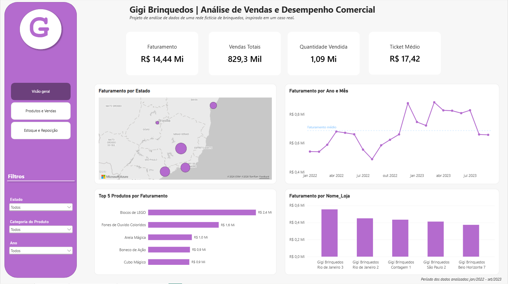
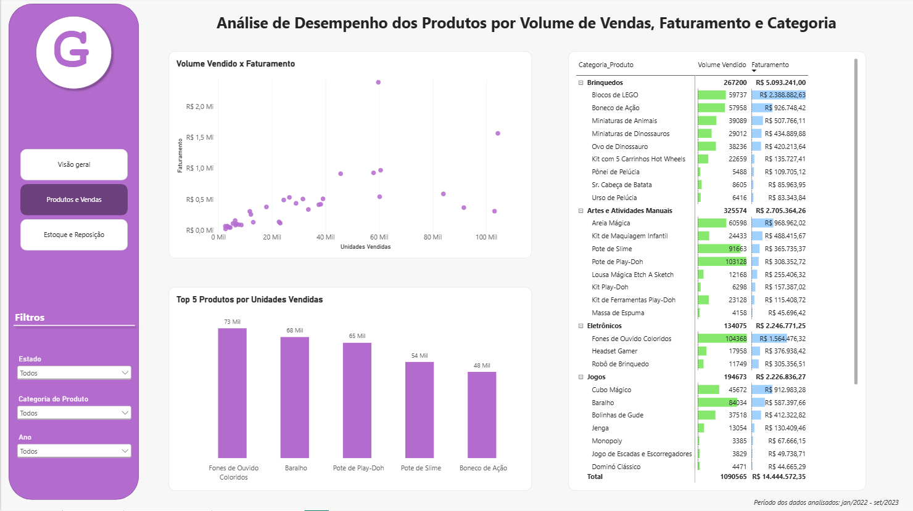
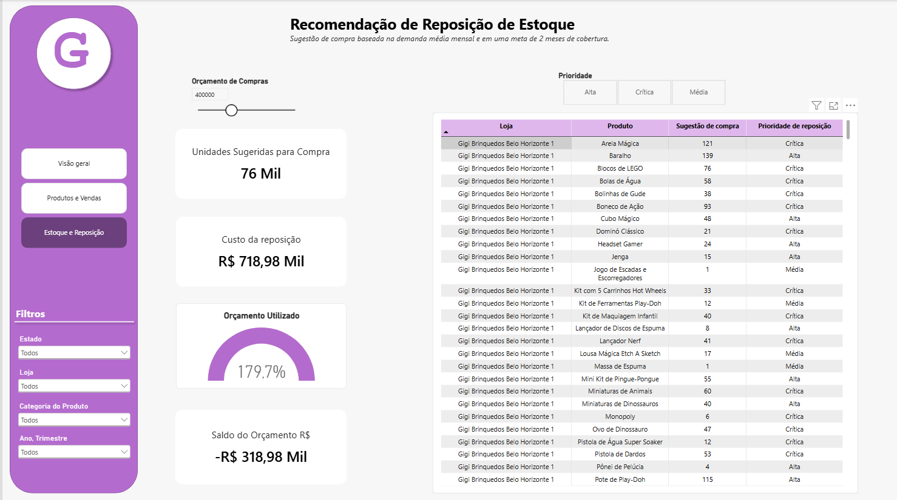

# 🧸 Gigi Brinquedos | Análise de Vendas, Estoque e Reposição

Pipeline de análise de dados — da validação e tratamento dos dados em SQL à construção de um dashboard interativo com recomendação de reposição e simulação de orçamento no Power BI.

### 🛠️ Tecnologias


---



## 🎥 Demonstração

Uma demonstração curta do dashboard mostra a navegação entre as páginas e a interação com os filtros, prioridades de reposição e simulação de orçamento.

▶️ **[Assistir à demonstração do dashboard](Dashboard/gigibrinquedos_dashboard_compressed1.mp4)**

## 🎯 Sobre o Projeto

A **Gigi Brinquedos** é uma empresa fictícia criada para simular um cenário real de varejo, com 50 lojas distribuídas entre Minas Gerais, São Paulo, Rio de Janeiro, Bahia e Distrito Federal.

O projeto parte de um problema comum em processos de compras e reposição: transformar dados de vendas e estoque em informações que apoiem decisões sobre **quais produtos precisam ser repostos, em quais quantidades e qual o impacto dessas compras no orçamento disponível**.

A solução foi desenvolvida de ponta a ponta, passando pela validação e preparação dos dados em SQL, análise exploratória, modelagem no Power BI, criação de medidas DAX e desenvolvimento de uma lógica de recomendação de reposição e simulação de orçamento.


## ❓ Perguntas de Negócio

A análise foi desenvolvida para responder questões como:

- Como estão as vendas da empresa e quais lojas, estados, categorias e produtos mais contribuem para o faturamento?
- Quais produtos apresentam maior volume de vendas?
- Qual é a demanda média mensal de cada produto?
- Por quanto tempo o estoque atual consegue atender à demanda estimada?
- Quais produtos devem ser priorizados para reposição?
- Quantas unidades precisam ser compradas?
- Qual é o custo estimado da reposição?
- A necessidade de compra é compatível com o orçamento disponível?


## 🛠️ Stack Técnica

| Tecnologia | Utilização no projeto |
|---|---|
| **SQL / SQLite** | Armazenamento, validação, tratamento e análise exploratória dos dados |
| **Power BI** | Modelagem dos dados e desenvolvimento do dashboard interativo |
| **DAX** | Criação de indicadores, cálculo de demanda, cobertura de estoque, reposição, prioridades e simulação financeira |
| **Excel** | Apoio na criação das tabelas auxiliares de tradução e adaptação dos dados |
| **ODBC** | Conexão entre o banco de dados SQLite e o Power BI |


## 🗃️ Preparação e Modelagem dos Dados

O projeto utiliza o dataset público **Mexico Toy Sales**, da Maven Analytics, preservando os arquivos originais em uma camada `raw`.

A preparação dos dados foi realizada em **SQL**, criando uma camada `processed` utilizada posteriormente nas análises e no Power BI. Entre as principais etapas estão:

- validação de valores nulos, registros vazios e duplicidades;
- verificação de integridade entre as tabelas;
- padronização de tipos e datas;
- tradução e adaptação dos produtos e lojas para o cenário fictício brasileiro;
- criação das tabelas processadas de vendas, produtos, lojas, estoque e calendário;
- análise exploratória de vendas, faturamento, produtos, lojas, categorias e estoque.

No Power BI, as tabelas processadas foram relacionadas às dimensões de **Produtos, Lojas e Calendário**, formando o modelo utilizado para os cálculos e visualizações.

> Os scripts utilizados no processamento, validação e análise exploratória estão disponíveis em [`Scripts/sql`](Scripts/sql).


## 📊 Dashboard

O dashboard foi estruturado em três níveis de análise, partindo da visão geral do negócio até a recomendação operacional de reposição.

### 📈 Página 1 — Visão Geral

Apresenta os principais indicadores de desempenho comercial da Gigi Brinquedos, permitindo acompanhar **faturamento, vendas totais, quantidade vendida e ticket médio**.

A página também permite analisar a evolução mensal do faturamento e comparar o desempenho entre estados, lojas e produtos.


### 🛍️ Página 2 — Produtos e Vendas

A segunda página aprofunda a análise do **mix de produtos**, relacionando volume vendido e faturamento.

O gráfico de dispersão permite identificar produtos com diferentes combinações de desempenho, enquanto o ranking e a matriz detalham os resultados por produto e categoria.




### 📦 Página 3 — Estoque e Reposição

A terceira página utiliza o histórico de vendas e o estoque disponível para gerar uma **recomendação de reposição por loja e produto**.

A solução estima a demanda média mensal, calcula a cobertura de estoque e classifica a necessidade de reposição em diferentes níveis de prioridade.

Também é possível selecionar um **orçamento de compras** e simular o impacto financeiro da recomendação, acompanhando unidades sugeridas, custo da reposição, percentual do orçamento utilizado e saldo disponível.




## 🧠 Lógica de Reposição

A recomendação de compra combina a **demanda média mensal histórica** com o **estoque atual** de cada combinação Loja × Produto.

Foi definida uma meta fictícia de **2 meses de cobertura de estoque**:

**Estoque-alvo = Demanda média mensal × 2**

A necessidade de compra é calculada por:

**Sugestão de compra = Máximo (Estoque-alvo − Estoque atual, 0)**

A cobertura de estoque também é utilizada para classificar a prioridade de reposição:

| Cobertura estimada | Prioridade |
|---|---|
| Menos de 0,5 mês | 🔴 Crítica |
| De 0,5 a menos de 1 mês | 🟠 Alta |
| De 1 a menos de 2 meses | 🟡 Média |
| 2 meses ou mais | Sem necessidade |
| Produto sem demanda | Sem demanda |

As prioridades são recalculadas dinamicamente de acordo com o período e os demais filtros aplicados no dashboard.

> As medidas utilizadas nessa lógica estão disponíveis em [`Scripts/dax/measures.dax`](Scripts/dax/measures.dax).


## 💰 Simulação de Orçamento

Para avaliar a viabilidade financeira da reposição, foi criado um parâmetro de orçamento que permite simular valores entre **R$ 200 mil e R$ 800 mil**, em intervalos de R$ 50 mil.

A partir do orçamento selecionado, o dashboard calcula dinamicamente:

- **Unidades sugeridas para compra**
- **Custo estimado da reposição**
- **Percentual do orçamento utilizado**
- **Saldo do orçamento**

Quando a necessidade de reposição supera o valor disponível, o percentual utilizado ultrapassa 100% e o saldo torna-se negativo.

A combinação do orçamento com o filtro de prioridade permite comparar diferentes cenários de compra e avaliar o impacto financeiro da reposição.


## 💡 Principais Insights

A análise dos dados permitiu identificar alguns pontos relevantes:

- Foram analisadas aproximadamente **829 mil vendas**, correspondentes a **1,09 milhão de unidades** e cerca de **R$ 14,44 milhões em faturamento** no cenário fictício.
- **Volume de vendas e faturamento não necessariamente apresentam o mesmo comportamento**: produtos com grande quantidade vendida podem ter menor contribuição financeira, enquanto produtos com menor volume podem gerar receita relevante devido ao preço.
- A **ruptura de estoque isoladamente não é suficiente para determinar a prioridade de reposição**. Um produto pode estar sem estoque em várias lojas e ainda apresentar baixa demanda histórica.
- A combinação entre **demanda e estoque** permite transformar a análise histórica em uma recomendação mais direcionada para o planejamento de compras.


## ⚠️ Limitações e Próximas Melhorias

A solução atual utiliza **dados históricos de vendas e uma fotografia do estoque**, portanto deve ser interpretada como uma simulação analítica de reposição, e não como um sistema de compras em produção.

A demanda é estimada pela média mensal histórica, sem incorporar ainda fatores como previsão de demanda, lead time de fornecedores, estoque de segurança ou pedidos de compra em aberto.

Como evoluções futuras, o projeto pode incluir:

- integração com uma fonte transacional ou API;
- pipeline para atualização automática dos dados;
- inclusão de lead time e estoque de segurança;
- modelos de previsão de demanda e tratamento de sazonalidade;
- consideração de pedidos de compra já realizados;
- priorização automática das compras quando o orçamento for inferior à necessidade total.


## 📂 Estrutura do Repositório

```text
gigi-brinquedos-analise-reposicao/
│
├── Data/
│   ├── raw/                 # Dados originais
│   └── auxiliary/           # Tabelas auxiliares de tradução
│
├── Scripts/
│   ├── sql/                 # Processamento, validação e análise exploratória
│   └── dax/                 # Medidas utilizadas no Power BI
│
├── Dashboard/
│   ├── Gigi_Brinquedos_Analise_Vendas_Estoque.pbix
│   └── dashboard_demo.mp4
│
├── Images/                  # Screenshots do dashboard
│
├── Documentation/           # Documentação técnica completa do projeto
│
└── README.md
```


## ▶️ Como Executar

Para explorar o projeto localmente:

1. Clone ou faça o download deste repositório.
2. Consulte os dados utilizados na pasta [`Data`](Data).
3. Os scripts de preparação, validação e análise exploratória estão disponíveis em [`Scripts/sql`](Scripts/sql).
4. As medidas DAX utilizadas no dashboard estão documentadas em [`Scripts/dax/measures.dax`](Scripts/dax/measures.dax).
5. Abra o arquivo [`Gigi_Brinquedos_Analise_Vendas_Estoque.pbix`](Dashboard/Gigi_Brinquedos_Analise_Vendas_Estoque.pbix) no Power BI Desktop.

> Para uma descrição detalhada das etapas, regras de negócio e limitações da solução, consulte a documentação disponível na pasta [`Documentation`](Documentation).


## 👩‍💻 Autoria

Projeto desenvolvido por **Giovanna Moreira** como parte do meu portfólio de Análise de Dados.

O projeto foi desenvolvido com foco na aplicação de **SQL, Power BI e DAX** na resolução de um problema de negócio relacionado a vendas, estoque e planejamento de reposição.
